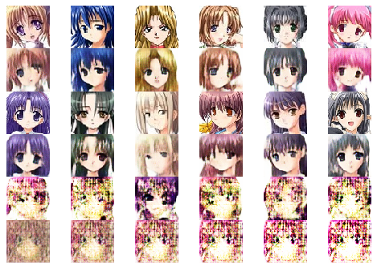

# Adversarial AutoEncoder (AAE)

Played around with AAE to try to generate some anime characters

By combining Generative Adversarial Network(GAN) With Autoencoder (AE) it helps reducing GAN having mode collapses and AE producing blurry image

# Example output

Row 1 and 3: input image  
Row 2 and 4: reconstructed image  
Row 5: image generated from random noise  
Row 6: image generated from interpolated noise

